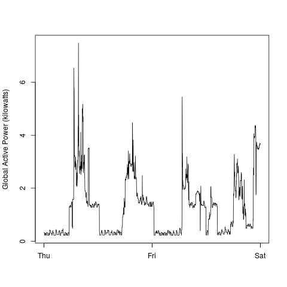

## Exploratory Data Analysis - Course Project 1

The master branch was forked from the instructor's Github page. All submissions required for the course project are on the master branch. Codes plot1.R, plot2.R, plot3.R and plot4.R are on the [root][1] directory and the corresponding figures, as shown below, are stored in the "plots" sub-directory.

    

    

     

    

[1]: <https://github.com/mamafanfan/ExData_Plotting1> "Course Project 1"

